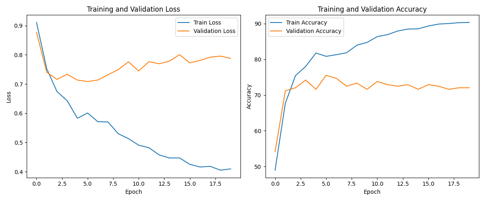

# Multimodal Sentiment Analysis 

This project focuses on **Multimodal Sentiment Analysis**, where sentiment is predicted by combining information from multiple modalities — **text**, **audio**, and **visual** signals — extracted from video content.

##  Project Overview

Multimodal Sentiment Analysis is the task of understanding and interpreting emotions or sentiments by leveraging more than one modality. For example, a person might say "I'm fine" (neutral text), but the tone (audio) and facial expressions (visual) may suggest otherwise.

This project aims to:
- Extract and process features from video (facial cues), audio (voice tone), and text (spoken content).
- Fuse these features to predict sentiment (positive, negative, or neutral).
- Compare unimodal and multimodal model performances.

## Files
- `MSA.ipynb`: Main notebook for data loading, training, and evaluation.
- `script.py`: Utility functions for dataset inspection and preprocessing.
- `aligned_50.pkl`: Pickle file containing the preprocessed dataset.
- `README.md`: Project overview and usage instructions.

## ⚙Requirements
- Python 3.8+
- PyTorch
- NumPy
- Matplotlib
  
##  Features Used

- **Text**: Extracted using `Google Speech-to-Text` / `whisper` / any ASR model.
- **Audio**: MFCCs, pitch, energy, prosodic features.
- **Visual**: Facial landmarks, expression features via OpenCV or DeepFace/FER libraries.

## 📊 Training Performance

The following figure shows the training and validation loss and accuracy over epochs:

